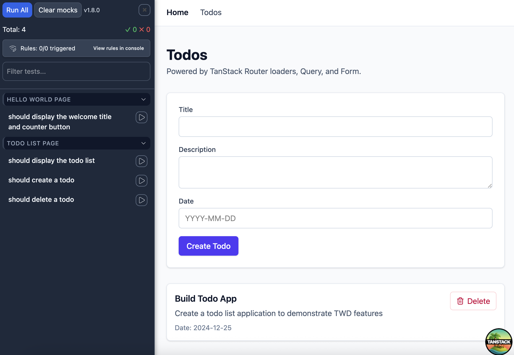

# twd-tanstack-example

A showcase of the [TanStack](https://tanstack.com) ecosystem — Router, Query, and Form — tested **in the browser, while you build**, with [TWD](https://github.com/BRIKEV/twd-js).



The sidebar on the left is TWD running real assertions against the app on the right. No extra renderer, no jsdom, no separate "test build" — just the dev server and a small panel.

---

## What this project demonstrates

| TanStack | Where it lives | What it does |
|---|---|---|
| **Router** | `src/routes/*` | File-based routing, code-split routes, root context, navigation with `<Link>`, 404 `notFoundComponent` |
| **Router loaders** | `src/routes/todos.tsx` | `loader` calls `queryClient.ensureQueryData(...)` so the page already has data when it mounts |
| **Query** | `src/api/queries.ts`, `src/query-client.ts` | `queryOptions` shared between loader and component, `useSuspenseQuery` in the view, `useMutation` + `invalidateQueries` for create/delete |
| **Form** | `src/routes/todos.tsx` | `useForm`, per-field validation, `<form.Subscribe>` for submit state |

The rest of the stack:

- **Vite** dev server on `:3000`, `/api` proxied to a json-server on `:3001`.
- **Tailwind v4** for styling.
- **TWD** (`twd-js` + `twd-relay`) for browser-side tests, **twd-cli** for headless CI runs.
- **vite-plugin-istanbul** + **nyc** for coverage.
- **openapi-mock-validator** (via twd-cli) validating mocks against `contracts/todos-3.0.json` on every CI run.

---

## Getting started

```bash
npm install
npm run serve:dev   # json-server on :3001 + Vite dev on :3000
```

Open <http://localhost:3000>. The TWD sidebar opens with the app — hit **Run All** to run the tests in `src/twd-tests/`.

---

## Writing a TWD test — the whole thing

TWD tests are plain `.ts` files next to your code. They run **inside the same browser tab as your app**, so they can import anything the app uses.

```ts
// src/twd-tests/helloWorld.twd.test.ts
import { twd, userEvent, screenDom } from 'twd-js'
import { describe, it, beforeEach } from 'twd-js/runner'
import { queryClient } from '#/query-client'

describe('Hello World Page', () => {
  beforeEach(() => {
    twd.clearRequestMockRules()
    queryClient.clear()
  })

  it('counts up when you click', async () => {
    await twd.visit('/')

    const button = await screenDom.findByText('Count is 0')
    await userEvent.click(button)
    twd.should(button, 'have.text', 'Count is 1')
  })
})
```

That's it. No render setup, no `MemoryRouter`, no `QueryClientProvider` wrapper in the test. The real router, the real query client, the real DOM.

Look at `src/twd-tests/todoList.twd.test.ts` for the data-fetching version: it mocks `/api/todos` with `twd.mockRequest`, waits for the request with `twd.waitForRequest`, and asserts on the resulting DOM.

---

## Testing consideration: SPA navigation keeps module-level state alive

This is something to keep in mind whenever you write TWD tests against an app that caches data in memory. It will come up in **any** project that uses TanStack Query, Zustand, Valtio, Apollo, or anything else that holds state at the module level — not just this one. If you're not aware of it, your tests will look like they have a network problem when they actually have a state problem.

**The setup.** `twd.visit('/somewhere')` is a router navigation, not a page reload — same browser tab, same JS runtime, same module instances.

**The trap.** TanStack Query caches results by key. A loader that calls `ensureQueryData(['todos'])` will fetch the first time, then on every subsequent `twd.visit('/todos')` it will return the cached array **without ever calling fetch**. The MSW mock you set up for that test never matches anything, and you get:

```
Rule "getTodoList" was not executed within 1000ms.
  Executed rules: none
```

The test fails for what looks like a network reason but is really a *state* reason.

**The fix.** Export the `QueryClient` as a module-level singleton and call `clear()` between tests:

```ts
// src/query-client.ts
import { QueryClient } from '@tanstack/react-query'

export const queryClient = new QueryClient({
  defaultOptions: { queries: { staleTime: 1000 * 30 } },
})
```

```ts
// any *.twd.test.ts
import { queryClient } from '#/query-client'

beforeEach(() => {
  twd.clearRequestMockRules()
  queryClient.clear()
})
```

ESM modules are singletons, so the cache the test clears **is** the cache the app reads from. No `window` globals, no test-only branches. The same pattern works for Zustand (`store.getState().reset()`), Valtio, etc. — anything you can `import`, you can reset.

You can see the difference in two of this project's commits: the QueryClient extraction (`refactor: extract QueryClient to a singleton module`) and the test update that added `queryClient.clear()` to `beforeEach`.

---

## Project layout

```
src/
  api/
    todos.ts          # fetch helpers, types derived from contracts/todos-3.0.json
    queries.ts        # todosQueryOptions (shared by loader + component)
  routes/
    __root.tsx        # nav, Devtools panels, 404 component
    index.tsx         # Home (counter)
    todos.tsx         # loader + useSuspenseQuery + useMutation + useForm
  twd-tests/          # *.twd.test.ts run in-browser via TWD
    mocks/
  query-client.ts     # singleton QueryClient (importable from tests)
  router.tsx          # createAppRouter() — wires routeTree + queryClient context
  main.tsx            # <QueryClientProvider><RouterProvider/></QueryClientProvider>
contracts/
  todos-3.0.json      # OpenAPI 3.0 spec, validated against mocks in CI
data/
  data.json           # json-server seed
twd.config.json       # twd-cli headless config + contract validation
```

---

## Scripts

| Command | What it does |
|---|---|
| `npm run dev` | Vite dev server on `:3000` (TWD sidebar opens automatically) |
| `npm run serve` | json-server on `:3001` |
| `npm run serve:dev` | Both in parallel |
| `npm run dev:ci` | Same as `dev` but with `CI=true` (turns on istanbul instrumentation) |
| `npm run test:ci` | Headless run via `twd-cli` (used by GitHub Actions) |
| `npm run collect:coverage:text` | Print coverage to stdout |

---

## CI

`.github/workflows/ci.yml` boots `dev:ci`, runs `twd-cli` headless via the official action, validates every mock response against the OpenAPI spec, posts a contract report as a PR comment, and prints coverage. See `twd.config.json` for the contract configuration.
